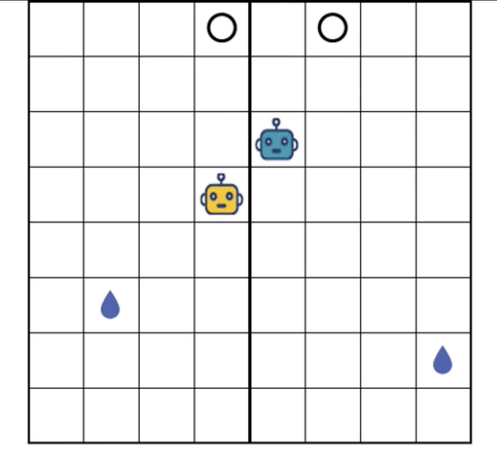

# Cooperative Poking Task with MARL
This project models social cooperation under the multi-agent reinforcement learning (MARL) framework. The environment consists of two agents moving on opposite sides of an arena. They receive rewards for coordinating a nose-poke action—this occurs when both agents enter a designated nose-poke location within a 2-step window. Upon successfully cooperating, they can access a water location to earn additional rewards.



## Environment Setup

1. Create a virtual environment
```bash
# Create a new virtual environment
python3.10 -m venv venv # The requirments are tested on python 3.10
# Activate the virtual environment (on Linux):
source venv/bin/activate
```
2. Install the required packages, before running this make sure your virtual environment is activated, you should see (venv) at the beginning of your terminal prompt.
```bash
pip install -r requirements.txt
```
**Note**: Ray version 2.2 may have compatibility issues on macOS. To avoid potential issues, consider using Linux or Windows, or manually compiling Ray before setting up your environment.


## Training

Training is divided into two phases: the non-cooperative phase and the cooperative phase.

* In the **non-cooperative phase**, agents independently perform nose-poke actions and drink water.
* In the **cooperative phase**, agents are only rewarded when they successfully coordinate a nose-poke within 2 steps.

Use `train.sh` as the training entry point.

### Non-cooperative phase 
To train agents independently, use the following command:
```
bash train.sh non_coop results/non_coop 
```
* First argument: `"non_coop"` (specifies non-cooperative training)
* Second argument: Output directory for training results
  
### Cooperative phase
The cooperative training phase builds on agents trained in the non-cooperative phase. Use the following command:
```
bash train.sh coop results/coop False results/non_coop
```
* First argument: `"coop"` (specifies cooperative training)
* Second argument: Output directory for training results
* Third argument: `False` (specifies if there is an existing training experiment to be resumed)
* Forth argument: Path to the non-cooperative training directory (the highest-performing checkpoint will be loaded)

**Note**: to resume a training experiment that has been stopped pre-maturely, set the third argument to the name of the training folder (by default, this is the date and time that the training experiment started).

```
bash train.sh coop results/coop PPO_2025-02-20_21-29-42 results/non-coop
```

## Evaluation

Evaluate agents' performance in the following ways

 In the example scripts, replace `[training_dir_path]` with the training directory and replace `[phase]` with either `coop` or `non_coop`
* Generate roll-out videos to visualize agents behaviors
  ```
  bash evaluate.sh gen_video [training_dir_path] [phase] 
  ```

* Compare cooperative behaviors to chance level across training iterations
  ```
  bash evaluate.sh save_metrics [training_dir_path] [phase] 
  ```
* Extract and save neuron activations 
  ```
  bash evaluate.sh save_activations [training_dir_path] [phase] 
  ```
* Evalute the effect of ablating certain neuron populations (modify `evaluate.sh` to include an ablation list):
  ```
  bash evaluate.sh ablation [training_dir_path] [phase] 
  ```
